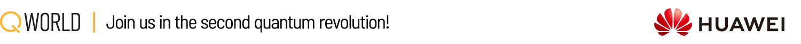

# [QWorld](https://qworld.net)'s Bronze-ProjectQ

**Bronze** is our introductory tutorial on _**quantum computing and quantum programming**_ created in October 2018.

**Bronze-ProjectQ** is the version of Bronze using [**ProjectQ**](hhttps://projectq.ch) as the quantum programming framework. It was released with the support of [**Huawei Technologies Co., Ltd.**](https://www.huawei.com/en) in October 2021.

Bronze is a collection of Jupyter notebooks, and each notebook has many programming tasks to provide hands-on experiences. We see Bronze as a laboratory where you can learn the basics of quantum computing and quantum programming by doing. Bronze has already been used in more than 60 workshops ([the most recent list](http://qworld.net/workshop-bronze/#list)) under QWorld. As a pedagogical strategy, we skip to use complex numbers to keep the tutorial simpler. 

## Prerequisite

The only prerequisite is to know the basics of programming (variables and basic data types, loops, and conditionals). Any previous experience in python will be helpful. If you do not have any such experince, you can check our notebooks on python before starting the tutorial.

Bronze has notebooks on the basic math to review your knowledge on the basic operations on vectors and matrices.

## Bronze-ProjectQ's sections

- Python (for a quick review)
- Basic math (for a quick review)
- Classical systems: bits, coin-flipping, probabilistic state and operators, composite systems, correlation, and controlled operators
- Quantum systems with ProjectQ
    - ProjectQ basics: circuit design, visualization, and simulation
    - quantum basics: quantum coin-flipping and Hadamard operator, quantum states and opeators, visualization of a real-valued qubit, superposition and measurements
    - quantum operators on a real-valued single qubit (rotations and reflections) and quantum tomography
    - entanglement and basic quantum protocols superdense coding and quantum teleportation
    - Grover's search algorithm

Our following elementrary level tutorial _Silver_ can be accessed [here](https://gitlab.com/qworld/silver).

## Contribution

Please make a merge request or create an issue for _reporting typo_ or _your corrections_.

Please create an issue for _your questions_, _initiating a discussion_, or _proposing a contribution_.

_Bronze has been developed under [QEducation departmant](https://qworld.net/qeducation/) of QWorld._

## Installation

Follow the instructions given in the [installation file](installation.pdf).

Here is a [video recording](https://youtu.be/yVmKA3ks_zA) about how to complete installation step by step.

## License

The text and figures are licensed under the Creative Commons Attribution 4.0 International Public License (CC-BY-4.0), available at https://creativecommons.org/licenses/by/4.0/legalcode. 

The code snippets in the notebooks are licensed under Apache License 2.0, available at http://www.apache.org/licenses/LICENSE-2.0.

## Acknowledgements

We use [MathJax](https://www.mathjax.org) to display mathematical expressions on html files (e.g., exercises).

We use open source interactive tool [quantumgame](http://play.quantumgame.io) for showing quantum coin flipping experiments.

## Credits

Bronze was created by [Abuzer Yakaryilmaz](http://abu.lu.lv) (QWorld & QLatvia) in October 2018, and it has been developed and maintained by him. 

Özlem Salehi Köken (QWorld & QTurkey) and Maksims Dimitrijevs (QWorld & QLatvia) are the other contributors by preparing new notebooks and revising the existing notebooks.

Bronze was publicly available on July 7, 2019.

ProjectQ adaptation was done by Vishal Sharathchandra Bajpe, Marija Šćekić, and Abuzer Yakaryilmaz between June and October 2021.

### Video lectures

The recording lectures for classical systems were prepared by Abuzer Yakaryilmaz in August 2020.

The installation recording was prepared by Vishal Sharathchandra Bajpe in October 2021.

### Bronze-ProjectQ 2021

Agnieszka Wolska prepared the new graphics and logos.

The installation instructions was prepared by Vishal Sharathchandra Bajpe.

We thank Claudia Zendejas-Morales and Kenneth Isamade to make some revisions of the quantum parts before using it during [QBronze69](https://qworld.net/qbronze69-china-october-2021/) workshop.

### Bronze 2020 & 2021

We thank to the participants of QBronze workshops and [QTraining for Bronze program](https://qworld.net/qtraining-for-bronze-2020/) for their corrections and suggestions.

### Bronze 2019

We thank to the mentors and participants of [QDrive](https://qworld.net/qdrive/) for their very helpful corrections and suggestions.

We thank Adam Glos (QWorld & QPoland) for his comments on Bronze 2018.

### Bronze 2018

We thank to Katrina Kizenbaha from Riga TechGirls for her revisions on our notebooks on python.

We thank to Martins Kalis (QLatvia) for his technical comments on python, qiskit, and our notebooks.

We thank to Maksims Dimitrijevs (QLatvia) for his careful reading and corrections on our notebooks.

We thank to QLatvia's first members Martins Kalis, Maksims Dimitrijevs, Aleksejs Naumovs, Andis Draguns, and Matiss Apinis for their help and support.

We thank to the students of [Faculty of Computing](https://www.df.lu.lv) (University of Latvia) attending quantum programming's meetings on each Friday (Fall 2018) for their comments while working with our notebooks.